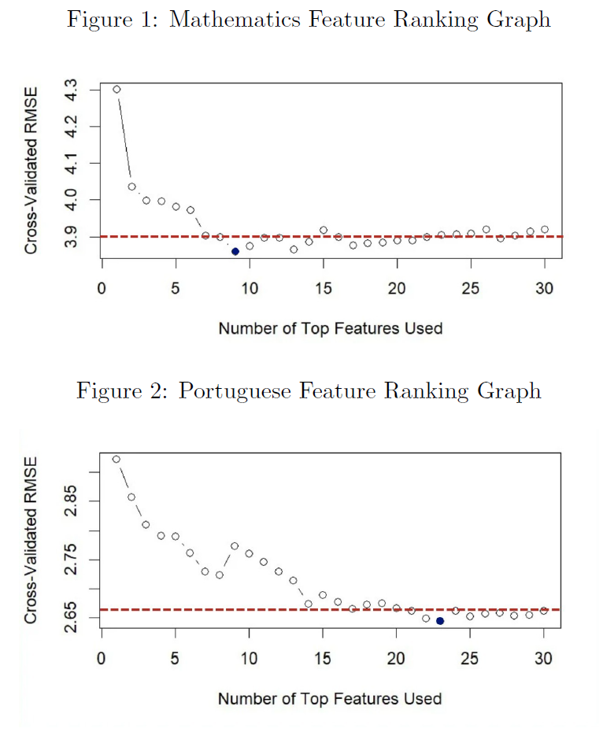

# Predicting Secondary School Student Performance: Replication and Improvement
This repository contains the code and analysis for our project, which **replicates and extends** the 2008 study by **Cortez & Silva**, ["Using Data Mining to Predict Secondary School Student Performance."](https://www.researchgate.net/publication/228780408_Using_data_mining_to_predict_secondary_school_student_performance) The study employed machine learning models to predict the final grades (G3) of secondary school students, utilizing demographic, social, and academic data.

Our project was conducted in **R** and builds on their work in two phases:

1. Replication – Faithfully reproducing the results of the original study across regression, binary classification, and five-level classification tasks.

2. Extension – Implementing systematic **feature selection methods** to reduce noise, build simpler models, and improve predictive performance in real-world scenarios.

The full analysis and findings are detailed in the accompanying [Final Report](Final_Report.pdf).


-------------------------------------------------------------------------------------------------------

# Key Findings and Improvements
The extension work, which focused on the most challenging real-world scenario (Setup C, where no prior grades are available), yielded significant improvements:

1. **Identified Core Predictors:** Using Random Forest-based feature ranking, an optimal subset of **9 core predictors for the Mathematics dataset** and **23 for the Portuguese dataset** was identified.
   
2. **Improved Model Performance:** Models trained on these refined feature sets consistently performed better, including a **10% lower RMSE in regression for the Random Forest** and **5% increase in accuracy for the SVM classifier** on the 5-level Portuguese classification task.
   
3. **Enhanced Simplicity & Interpretability:** For Mathematics, the final model achieved comparable results with **70% fewer features** (9 vs. 30+), making it simpler and easier to interpret.

4. **Additional Performance Metric:** We analysed changes in Precision as an additional performance metric in the Binary Classification Case.
   
6. **Solving the Precision Problem:** The feature selection process significantly improved **Random Forest Precision** on the Binary Classification task, producing a more reliable predictor.

-------------------------------------------------------------------------------------------------------------------------------------------

# Feature Selection Process

To identify the optimal set of "core predictors," a Filter Method was implemented based on the feature importance metric from the randomForest package. The importance of each feature was calculated using the Percentage Increase in Mean Squared Error (%IncMSE). This method works by training a Random Forest Model and then, for each feature, randomly permuting its values in the out-of-bag (OOB) samples and measuring how much the model's prediction error (MSE) increases. A larger increase in error implies a more important feature.

```r
# Train a Random Forest model on the Setup C data
rf_model <- randomForest(G3 ~ ., data = data_C, importance = TRUE)

# Extract importance scores (%IncMSE) and sort them
raw_importance <- importance(rf_model, type = 1)
sorted_importance <- sort(raw_importance[,1], decreasing = TRUE)

# Get the final ranked list of feature names
ranked_features <- names(sorted_importance)

```

## Assumptions

We used the same features obtained in the Random Forest Regression Case for each subject for SVM, as well as in the binary and 5-level classification cases. In doing so, we made two core assumptions-

**1. Model-Independence:** We assumed that, due to the robustness of Random Forest (RF) as a model, the same features selected in RF would yield improved results in the SVM model.

**2. Case-Independence:** We assumed that the same features selected in the regression case would also yield improved results in the binary and 5-level classification cases.

These assumptions allowed us to obtain **sufficiently improved results** while substantially **reducing computational costs.**

## Number of Top Features vs. RF Performance:

The graphs below plot the cross-validated RMSE against the number of top-ranked features used to train the model. This visualization allowed us to identify the "sweet spot" where the model's performance maximized (RMSE minimized), indicating the optimal number of features to retain.



**Note:** The red dotted line in each graph reflects the respective benchmark performances when all features were used in replication.

----------------------------------------------------------------------------------------------------------------------------------

# Data Sources

The two datasets used in this analysis (**student-mat.csv** and **student-por.csv**) were sourced from the [UCI Machine Learning Repository](https://archive.ics.uci.edu/dataset/320/student+performance). They contain student grades, demographic, social, and school-related features.

-----------------------------------------------------------------------------------------------------------------------------------

# Repository Index

- 📂 student-prediction-plus
  - 📂 code
    - 📄 [Replication - Binary Classification](code/Replication_Binary_Classification.R)
    - 📄 [Replication - 5-Level Classification](code/Replication_5-Level_Classification.R)
    - 📄 [Replication - Regression](code/Replication_Regression.R)
    - 📄 [Improvement and Variable selection - Regression (Mathematics)](code/Improvement_Regression_and_Variable_Selection_Mathematics.R)
    - 📄 [Improvement and Variable selection - Regression (Portuguese)](code/Improvement_Regression_and_Variable_Selection_Portugese.R)
    - 📄 [Improvement Binary Classification (Mathematics)](code/Improvement_Binary_Classification_Mathematics.R)
    - 📄 [Improvement Binary Classification (Portuguese)](code/Improvement_Binary_Classification_Portugese.R)
    - 📄 [Improvement 5 Level Classification (Mathematics)](code/Improvement_5-Level_Classification_Mathematics.R)
    - 📄 [Improvement 5 Level Classification (Portuguese)](code/Improvement_5-Level_Classification_Portugese.R)
  - 📂 data
    - 📄 [student-mat.csv](data/student-mat.csv)
    - 📄 [student-por.csv](data/student-por.csv)
   
--------------------------------------------------------------------------------------------------------------------------------------------

# How to Run the Code

## Prerequisites:

**1. R:** Install a recent version (≥ 4.x).

**2. R Packages:** Install dependencies by running:

```r
install.packages(c("rminer", "randomForest"))
library(rminer)
library(randomForest)

```
**3. Note:** Ensure that [student-mat.csv](data/student-mat.csv) and [student-por.csv](data/student-por.csv) are in the R working directory when running the scripts.

## Steps for execution:

**1. Replication Scripts:** Run the replication scripts, which reproduce the baseline results from the original paper.

**2. Variable Selection:** Run [Improvement and Variable selection - Regression (Mathematics)](code/Improvement_Regression_and_Variable_Selection_Mathematics.R) and [Improvement Variable selection and Regression (Portuguese)](code/Improvement_Regression_and_Variable_Selection_Portugese.R), which perform Random Forest-based feature ranking and search for optimal predictors within the Regression setup.

**3. Run and evaluate the final, improved models** that take the optimal feature sets found in the previous step, for the binary and 5-Level Classification setup.


      


